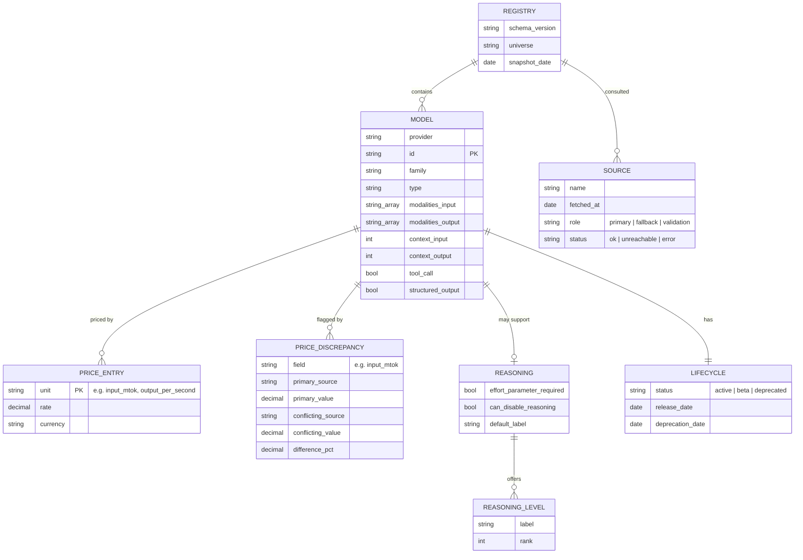

# Data model

This document is the concrete schema for the AI universe (`rates.ai`). [ARCHITECTURE.md](ARCHITECTURE.md) covers why it's shaped this way; this covers what's actually in it.

Every field here is a verified fact carried by at least one upstream source, never inferred opinion. Nothing in this schema ranks or scores a model. See "Excluded fields" below for what was considered and cut, and why.

## Entity relationships



A `MODEL` with no reasoning capability at all carries no `REASONING` record, the relationship is optional (`||--o|`), not a record with empty values. `PRICE_ENTRY` is one-to-many because a single model bills on more than one unit at once (input tokens, output tokens, cache reads, and so on), and different model types bill on entirely different units, not just different rates.

**The diagram shows cardinality, not the literal JSON shape.** `REASONING_LEVEL` is an array of `{label, rank}` objects in the actual JSON, the diagram and the document agree. `PRICE_ENTRY` is different: ER notation has no way to draw "one object with a variable number of dynamically-named keys," so it's decomposed into rows here to show that a model bills on several units at once. The JSON itself never has an array called `price_entries`, `price` is one flat object (`{"currency": "USD", "input_mtok": 5, "output_mtok": 25, ...}`), each unit name is a key, not a row in a list. Build from [the worked example](#worked-example) below, not from the entity box, if the two ever seem to disagree.

## `REGISTRY` (the envelope)

| Field | Type | Notes |
|---|---|---|
| `schema_version` | string | Semver of this document's shape, independent of the `rates` package version |
| `universe` | string | `"ai"` for this universe |
| `snapshot_date` | date | When this release was generated. This, not a per-model timestamp, is how "did this change" gets answered, by diffing two dated releases |
| `sources` | `SOURCE[]` | Every upstream source consulted for this release, with its role and `status`. On a `ledger` release every source is expected `ok`; on a `live` call, `status` is how a caller sees that a source was skipped for being unreachable rather than silently missing |

## `MODEL`

| Field | Type | Primary source | Notes |
|---|---|---|---|
| `provider` | string | models.dev | Raw provider identifier, e.g. `"anthropic"` |
| `id` | string | models.dev | Provider's own model identifier |
| `family` | string | models.dev | Lineage grouping, e.g. `"claude-opus"` |
| `type` | string | LiteLLM `mode` | `chat`, `embedding`, `rerank`, `image_generation`, `image_edit`, `audio_speech`, `audio_transcription`, `video_generation`, `moderation`, or similar. Not derivable from modality alone, see below |
| `modalities.input` / `.output` | string[] | models.dev, cross-checked against OpenRouter | Content formats, e.g. `["text", "image", "file"]` |
| `context.input` / `.output` | int \| null | models.dev | Split, since input and output limits often differ |
| `tool_call` | bool | models.dev | |
| `structured_output` | bool | models.dev | |
| `price` | `PRICE_ENTRY[]` | models.dev, gaps filled from LiteLLM/genai-prices | See below |
| `price_discrepancies` | `PRICE_DISCREPANCY[]` | Computed during fusion | Empty when sources agree, not `null`. See below |
| `reasoning` | `REASONING` \| null | models.dev, cross-checked against OpenRouter | Absent, not empty, when the model has no reasoning capability |
| `lifecycle` | `LIFECYCLE` | genai-prices (bool) + LiteLLM (date) + models.dev (`status`) | See below |

### Why `type` is a separate field from `modalities`

`modalities` describes the content format crossing the wire, text, image, audio, video, file. `type` describes what the API contract does with it. They correlate but neither derives from the other: Cohere's `rerank-english-v2.0` and OpenAI's `omni-moderation-2024-09-26` both show a text-in/text-shaped-out modality, the same shape a chat model has, while being a ranking operation and a classification operation respectively, not a conversation. A schema that only carried `modalities` would have no way to tell those apart from a chat model.

## `PRICE_ENTRY`

Named for the one-to-many relationship in the diagram above (a model bills on several units at once), not for the JSON shape, which is one flat `price` object per model, not an array of entry records. See the note under "Entity relationships" if that's not clear from the diagram alone.

Price is a flat map of unit name to rate, never a single blended number, and never a single unit assumed for the whole model. Different model types bill on fundamentally different dimensions in production today:

| Unit | Example model | Rate |
|---|---|---|
| `input_mtok` / `output_mtok` | `claude-opus-5` | $5 / $25 per million tokens |
| `cache_read_mtok` / `cache_write_mtok` | `claude-opus-5` | $0.50 / $6.25 per million tokens |
| `web_search_per_kcount` | `claude-opus-5` | $10 per 1,000 searches |
| `output_per_second` | `veo-3.1-fast-generate-preview` | $0.15 per second of generated video |

A caller who wants a single comparable number (a "blended $/mtok," say) computes it themselves from the raw units and their own expected usage mix. Baking in a fixed input:output weighting was an earlier design choice, reverted, it assumed a usage ratio that isn't true for every caller.

## `PRICE_DISCREPANCY`

Primary wins outright when sources disagree, models.dev's value is always what lands in `price`, no algorithmic tie-breaking. But the disagreement itself is a fact, not noise to discard: checked directly across genai-prices and models.dev on 355 model records where both describe the same provider and the same model, 93 (26%) disagreed by more than 1% on input price. Silently dropping that would hide something real, especially since the majority of `rates`' actual reads are against a static `ledger` file, generated once by a fusion run nobody watching the pipeline that week ever revisits, a warning at fusion time would never reach that reader. Stored on the record instead, it travels with the data.

Concentrated, not random: of those 93 disagreements, 89 were on OpenRouter or open-weight community models (`qwen`, `deepseek`, `phi-4`, `mistral-small`). First-party stable APIs (Anthropic, Google, OpenAI called direct) showed zero disagreement in the same sample. Mostly staleness skew between two sources' fetch times on genuinely volatile, aggregator-routed pricing, not a dispute about a fixed fact.

**Threshold: 2%**, grounded in that same check, clean agreement clustered at ≤1%, real disagreement started around 3-4% and climbed fast (many past 50%). 2% clears rounding/currency-conversion noise without missing genuine cases.

| Field | Type | Notes |
|---|---|---|
| `field` | string | Which price unit disagreed, e.g. `"input_mtok"` |
| `primary_source` | string | Always `"models_dev"` currently, the source whose value is actually used |
| `primary_value` | decimal | The value in `price`, i.e. what a caller actually gets |
| `conflicting_source` | string | Which fallback source disagreed |
| `conflicting_value` | decimal | What that source reported instead |
| `difference_pct` | decimal | `abs(primary - conflicting) / max(abs(primary), abs(conflicting)) * 100` |

Real example, `deepseek/deepseek-chat-v3.1` on OpenRouter:

```json
{
  "field": "input_mtok",
  "primary_source": "models_dev",
  "primary_value": 0.55,
  "conflicting_source": "genai_prices",
  "conflicting_value": 0.21,
  "difference_pct": 61.8
}
```

## `REASONING`

Reasoning-effort control differs enough across models that a single range doesn't fit all of them. Four shapes exist, all visible in xAI's Grok lineup alone:

| Shape | Example | `REASONING` record |
|---|---|---|
| No reasoning capability | `grok-4.20-0309-non-reasoning` | Absent entirely, the field doesn't apply |
| Always-on, no dial | `grok-4.20-0309-reasoning` | Present, `levels: []`, `range: null` |
| Mandatory once engaged, no off switch | `claude-opus-5`, `grok-4.6` | `can_disable_reasoning: false`, `levels` starts at rank `1` |
| Optional, `none` is a real selectable value | `grok-4.3` (`values: [none, low, medium, high]`) | `can_disable_reasoning: true`, `levels` starts at rank `0` |

`none` is never assumed present. It's included in `levels` exactly when a source lists it as a value the model actually accepts, never added as a universal floor.

Each entry in `levels` pairs a `label` (the string an API call actually needs) with a `rank` (its position in that model's own ascending order, for a caller doing arithmetic, "give me this model's cheapest reasoning setting," "give me the midpoint, rounded down"). The rank is only comparable within one model's own `levels`, `medium` on one model and `medium` on another aren't claimed to cost the same.

`effort_parameter_required` and `can_disable_reasoning` are deliberately two separate booleans, not one. A model can require no explicit parameter (a default effort applies) while still never allowing reasoning to be switched off, `claude-opus-5` is exactly this case, `mandatory: false` upstream (the parameter is optional) but no `none` in its values (you can't disable it if you try).

## `LIFECYCLE`

The one axis flagged as most important to get right: knowing whether a model is still viable to build on, before paying for it.

| Field | Type | Source |
|---|---|---|
| `status` | `"active"` \| `"beta"` \| `"deprecated"` | models.dev |
| `release_date` | date | models.dev (the "date of manufacture") |
| `deprecation_date` | date \| null | LiteLLM. Can be past (already retired) or future (scheduled sunset, still callable until then) |

## Excluded fields, and why

| Field | Why it's out |
|---|---|
| A fixed `dev`/`bulk`/`economy`/`quality` tier | Bakes in an opinion price alone can't establish, and required permanent hand-curation to stay correct. See [ARCHITECTURE.md](ARCHITECTURE.md) |
| Blended `$/mtok` | Assumes a fixed input:output usage ratio that isn't true for every caller. Raw per-unit prices let the caller blend it themselves |
| `benchmarks` (third-party Elo/index scores, available from OpenRouter) | Someone else's opinion of quality, not a fact about price or capability. `rates` is a pricing registry, not a benchmark aggregator |
| `open_weights` | Deferred; not needed for this release |
| Per-model `last_updated` | Mirrors the upstream source's sync cadence more than any real change to the model. Since `rates` ships dated, versioned snapshots, "did this change" is answered by diffing two releases, not by trusting a source's own timestamp of unclear meaning |

## Worked example

Values for `claude-opus-5`:

```json
{
  "provider": "anthropic",
  "id": "claude-opus-5",
  "family": "claude-opus",
  "type": "chat",
  "modalities": { "input": ["text", "image", "file"], "output": ["text"] },
  "context": { "input": 1000000, "output": 128000 },
  "price": {
    "currency": "USD",
    "input_mtok": 5,
    "output_mtok": 25,
    "cache_read_mtok": 0.5,
    "cache_write_mtok": 6.25,
    "cache_write_1h_mtok": 10,
    "web_search_per_kcount": 10
  },
  "price_discrepancies": [],
  "reasoning": {
    "effort_parameter_required": false,
    "can_disable_reasoning": false,
    "levels": [
      { "label": "low", "rank": 1 },
      { "label": "medium", "rank": 2 },
      { "label": "high", "rank": 3 },
      { "label": "xhigh", "rank": 4 },
      { "label": "max", "rank": 5 }
    ],
    "range": [1, 5],
    "default": "high"
  },
  "tool_call": true,
  "structured_output": true,
  "lifecycle": { "status": "active", "release_date": "2026-07-24", "deprecation_date": null },
  "sources": { "models_dev": "2026-08-16", "genai_prices": "2026-08-16", "openrouter": "2026-08-16" }
}
```

`claude-opus-5`'s sources agree, so `price_discrepancies` is empty. `deepseek/deepseek-chat-v3.1` on OpenRouter is the case where they don't (same live fetch, 2026-08-22):

```json
{
  "provider": "openrouter",
  "id": "deepseek/deepseek-chat-v3.1",
  "price": { "currency": "USD", "input_mtok": 0.55 },
  "price_discrepancies": [
    {
      "field": "input_mtok",
      "primary_source": "models_dev",
      "primary_value": 0.55,
      "conflicting_source": "genai_prices",
      "conflicting_value": 0.21,
      "difference_pct": 61.8
    }
  ]
}
```

---

By [Mo Shehu](https://mohammedshehu.com)
