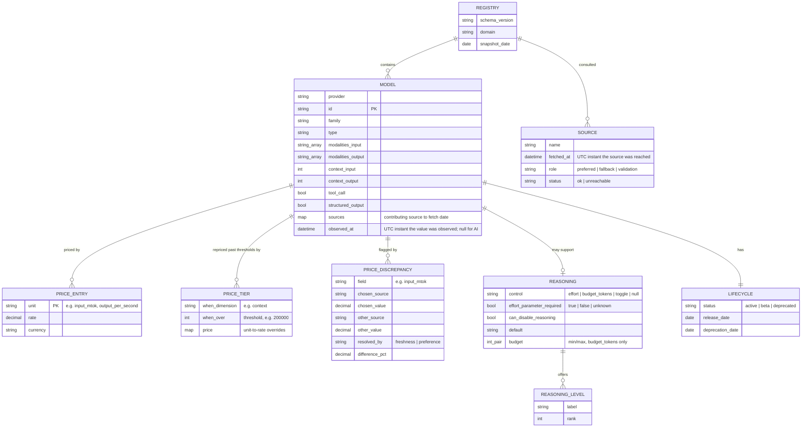

# Data model

This document is the concrete schema for the AI domain (`rates.ai`). [ARCHITECTURE.md](ARCHITECTURE.md) covers why it's shaped this way; this covers what's in it.

Every field here is carried by at least one upstream source, with one deliberate exception: `observed_at` is present on the record but unpopulated in the AI domain, reserved for a domain whose values are observed continuously (see its row below). See "Excluded fields" for what was considered and cut, and why.

## Entity relationships



A `MODEL` with no reasoning capability at all carries no `REASONING` record, the relationship is optional (`||--o|`), not a record with empty values. `PRICE_ENTRY` is one-to-many because a single model bills on more than one unit at once (input tokens, output tokens, cache reads, and so on), and different model types bill on entirely different units, not just different rates.

**The diagram shows cardinality, not the literal JSON shape.** `REASONING_LEVEL` is an array of `{label, rank}` objects in the actual JSON, the diagram and the document agree. `PRICE_ENTRY` is different: ER notation has no way to draw "one object with a variable number of dynamically-named keys," so it's decomposed into rows here to show that a model bills on several units at once. The JSON itself never has an array called `price_entries`, `price` is one flat object (`{"currency": "USD", "input_mtok": 5, "output_mtok": 25, ...}`), each unit name is a key, not a row in a list. Build from [the worked example](#worked-example) below, not from the entity box, if the two ever seem to disagree.

## `REGISTRY` (the envelope)

| Field | Type | Notes |
|---|---|---|
| `schema_version` | string | Semver of this document's shape, independent of the `rates` package version. A later additive field bumps the minor; a reader checks the major, so an older ledger still loads |
| `domain` | string | `"ai"` for this domain |
| `snapshot_date` | date | The daily snapshot's calendar identity: the value a `stable` check compares to find a newer release, and the date in its `ledger-YYYY-MM-DD` tag. A date, not an instant, because the AI ledger publishes once a day; a continuously-updated domain defines its own envelope. This, not a per-model timestamp, is how "did this change" gets answered for AI, by diffing two dated releases |
| `sources` | `SOURCE[]` | Every upstream source consulted for this release, with its role and `status`. Each carries `fetched_at`, the UTC instant it was reached. On a `ledger` release every source is expected `ok`; on a `live` call, `status` is how a caller sees that a source was skipped for being unreachable rather than silently missing |

## `MODEL`

| Field | Type | Primary source | Notes |
|---|---|---|---|
| `provider` | string | models.dev | Raw provider identifier, e.g. `"anthropic"` |
| `id` | string | models.dev | Provider's own model identifier |
| `family` | string | models.dev | Lineage grouping, e.g. `"claude-opus"` |
| `type` | string | LiteLLM `mode` (provider+id match, or bare-id match where every listing agrees); OpenRouter membership implies `chat` | Values in the current snapshot: `chat`, `completion`, `responses`, `embedding`, `image_generation`, `audio_speech`, `audio_transcription`, `realtime`; the vocabulary is open (upstream also defines `rerank`, `moderation`, and others, none of which currently clear admission). Never derived from modality alone, see below. Coverage is partial; untyped models never match a type filter |
| `modalities.input` / `.output` | string[] | models.dev, cross-checked against OpenRouter | Content formats, e.g. `["text", "image", "pdf"]` |
| `context.input` / `.output` | int \| null | models.dev | Split, since input and output limits often differ |
| `tool_call` | bool \| absent | models.dev | Absent means unknown, never `false`; a filter on it matches neither way |
| `structured_output` | bool \| absent | models.dev | Same tri-state rule as `tool_call` |
| `price` | `PRICE_ENTRY[]` | models.dev, gaps filled from LiteLLM/genai-prices | See below |
| `price_discrepancies` | `PRICE_DISCREPANCY[]` | Computed during fusion | Empty when sources agree, not `null`. See below |
| `reasoning` | `REASONING` \| null | models.dev, cross-checked against OpenRouter | Absent, not empty, when the model has no reasoning capability |
| `sources` | map | Computed during fusion | Which sources contributed to this record, each with its fetch date, e.g. `{"models_dev": "2026-08-23", "litellm": "2026-08-23"}`. Fallback-admitted records never list the preferred source, so provenance is filterable |
| `lifecycle` | `LIFECYCLE` | models.dev (`status`, `release_date`) + LiteLLM (`deprecation_date`) | See below |
| `observed_at` | datetime \| absent | Not supplied for AI | A UTC instant recording when this record's underlying value was observed upstream. Absent in the AI domain: list prices are announced, not observed to the second, and no source dates a price that finely. It exists on the record so a domain whose values move continuously (a market price) fills a stricter value into a field already present, rather than a later domain forcing a breaking change to add it. Distinct from the envelope's `snapshot_date` (a release's calendar identity) and from a source's `fetched_at` (when we reached the source): this is when the *value* was true |
| `alias` | `ALIAS` \| absent | KeyCall's per-provider alias-convention catalog, baked in at ledger-build time | Absent for a dated/pinned id, or a provider with no recorded convention. See below |

### Why `type` is a separate field from `modalities`

`modalities` describes the content format crossing the wire, text, image, audio, video, file. `type` describes what the API contract does with it. They correlate but neither derives from the other: Cohere's `rerank-english-v2.0` and OpenAI's `omni-moderation-2024-09-26` both show a text-in/text-shaped-out modality, the same shape a chat model has, while being a ranking operation and a classification operation respectively, not a conversation. A schema that only carried `modalities` would have no way to tell those apart from a chat model. (Neither model ships in the current catalog, no source supplies per-unit pricing for them; they're here as the counterexample that rules the derivation out.)

## `PRICE_ENTRY`

Named for the one-to-many relationship in the diagram above (a model bills on several units at once), not for the JSON shape, which is one flat `price` object per model, not an array of entry records. See the note under "Entity relationships" if that's not clear from the diagram alone.

Price is a flat map of unit name to rate, never a single blended number, and never a single unit assumed for the whole model. Different model types bill on fundamentally different dimensions in production today:

| Unit | Example model | Rate |
|---|---|---|
| `input_mtok` / `output_mtok` | `claude-opus-5` | $5 / $25 per million tokens |
| `cache_read_mtok` / `cache_write_mtok` | `claude-opus-5` | $0.50 / $6.25 per million tokens |
| `requests_kcount` | `sonar` (Perplexity) | $12 per 1,000 requests |
| `input_audio_mtok` | `gemini-2.5-flash` (aihubmix) | $1 per million audio tokens |

`output_per_second` (per-second media billing) is also in the vocabulary; its current carriers are transcription models priced at zero, so it makes a poor illustration and a fine unit.

A caller who wants a single comparable number (a "blended $/mtok," say) computes it themselves from the raw units and their own expected usage mix. Baking in a fixed input:output weighting was an earlier design choice, reverted, it assumed a usage ratio that isn't true for every caller.

## `PRICE_TIER`

Some providers reprice a model past a usage threshold, most commonly context size: Gemini and GPT long-context models charge one rate below 200k input tokens and a higher rate above. `price` always holds the base tier, so nothing about flat-price models, filtering, or `price_max` changes; tiers are an additional, optional `price_tiers` list:

```json
"price": { "currency": "USD", "input_mtok": 10, "output_mtok": 45 },
"price_tiers": [
  {
    "when": { "dimension": "context", "over": 200000 },
    "price": { "input_mtok": 20, "output_mtok": 90 }
  }
]
```

Each tier's `price` holds only the units that change; unnamed units fall through to base. `when` is open-shaped: `context` is the only dimension upstream data carries today, and a dimension beyond it (volume, batch) fits without schema change. On the caller side the tier is explicit opt-in, matching `price_unit`: `model.price` is the base tier, `model.price_for(context=500000)` resolves the applicable overrides into a flat price. `filter(price_max=...)` compares against base.

Covers all three upstream forms: models.dev's `tiers` list, its `context_over_200k` shorthand (a tier with `over: 200000`), and genai-prices' tiered list form.

## `PRICE_DISCREPANCY`

When sources disagree on a price, which value ships in `price` is decided by freshness first (whichever source's underlying data changed more recently for this record wins), falling back to a plain, editable per-field preference order when freshness can't decide. See ARCHITECTURE.md § Resolving price disagreements for the mechanism. The disagreement itself is stored either way, not discarded: checked directly across genai-prices and models.dev on 355 model records where both describe the same provider and the same model, 93 (26%) disagreed by more than 1% on input price. Silently dropping that would hide a verifiable fact, especially since the majority of reads against `rates` hit a static `ledger` file, generated once by a fusion run nobody watching the pipeline that week ever revisits, a warning at fusion time would never reach that reader. Stored on the record instead, it travels with the data.

Concentrated, not random: of those 93 disagreements, 89 were on OpenRouter or open-weight community models (`qwen`, `deepseek`, `phi-4`, `mistral-small`). First-party stable APIs (Anthropic, Google, OpenAI called direct) showed zero disagreement in the same sample. Mostly staleness skew between two sources' fetch times on volatile, aggregator-routed pricing, not a dispute about a fixed fact.

**Threshold: 2%**, grounded in that same check, clean agreement clustered at ≤1%, substantive disagreement started around 3-4% and climbed fast (many past 50%). 2% clears rounding/currency-conversion noise without missing substantive cases.

| Field | Type | Notes |
|---|---|---|
| `field` | string | Which price unit disagreed, e.g. `"input_mtok"` |
| `chosen_source` | string | Which source's value shipped in `price` |
| `chosen_value` | decimal | The value in `price`, i.e. what a caller gets |
| `other_source` | string | Which source disagreed |
| `other_value` | decimal | What that source reported instead |
| `resolved_by` | string | `"freshness"` (the chosen source's data changed more recently) or `"preference"` (freshness couldn't decide; the per-field preference order settled it) |
| `difference_pct` | decimal | `abs(chosen - other) / max(abs(chosen), abs(other)) * 100` |

A live example, `deepseek/deepseek-chat-v3.1` on OpenRouter:

```json
{
  "field": "input_mtok",
  "chosen_source": "models_dev",
  "chosen_value": 0.55,
  "other_source": "genai_prices",
  "other_value": 0.21,
  "resolved_by": "preference",
  "difference_pct": 61.8
}
```

## `REASONING`

Reasoning-effort control differs enough across models that a single range doesn't fit all of them. Four forms exist, all visible in xAI's Grok lineup alone:

| Shape | Example | `REASONING` record |
|---|---|---|
| No reasoning capability | `grok-4.20-0309-non-reasoning` | Absent entirely, the field doesn't apply |
| Always-on, no dial | `grok-4.20-0309-reasoning` | Present, `control: null`, `levels: []`, `range: null` |
| Mandatory once engaged, no off switch | `claude-opus-5`, `grok-4.6` | `can_disable_reasoning: false`, `levels` starts at rank `1` |
| Optional, `none` is a selectable value | `grok-4.3` (`values: [none, low, medium, high]`) | `can_disable_reasoning: true`, `levels` starts at rank `0` |

`none` is never assumed present. It's included in `levels` only when a source lists it as a value the model accepts, never added as a universal floor.

**`control` names how the dial works**, because three different control types exist upstream: `"effort"` (named levels; `levels` and `range` apply), `"budget_tokens"` (a numeric thinking budget; `budget: {min, max}` applies, `levels` is empty), and `"toggle"` (on/off, nothing else; neither applies). One field per meaning, rather than `range` holding level ranks for one model and token budgets for another. `control` is `null` when a source says the model reasons but describes no dial at all (the always-on row above); roughly a quarter of shipped reasoning records are in that state.

**`effort_parameter_required` is tri-state**: `true`/`false` where OpenRouter's per-model `reasoning.mandatory` covers the model, by direct provider+id match or by bare model id where every OpenRouter listing of that id agrees (roughly 1,100 shipped records as of 2026-08-23; `true` means the API errors without the parameter), absent where no source carries it. Unknown is never reported as `false`, the same rule `tool_call` follows. OpenRouter's `default_effort` likewise fills `default` where available.

Each entry in `levels` pairs a `label` (the string an API call needs) with a `rank` (its position in that model's own ascending order, for a caller doing arithmetic, "give me this model's cheapest reasoning setting," "give me the midpoint, rounded down"). The rank is only comparable within one model's own `levels`, `medium` on one model and `medium` on another aren't claimed to cost the same.

`effort_parameter_required` and `can_disable_reasoning` are deliberately two separate booleans, not one. A model can require no explicit parameter (a default effort applies) while still never allowing reasoning to be switched off, `claude-opus-5` is this very case, `mandatory: false` upstream (the parameter is optional) but no `none` in its values (you can't disable it if you try).

## `ALIAS`

Whether this record's own `id` is a rolling reference (`gemini-pro-latest`, `gpt-5.6-chat-latest`) rather than a dated snapshot, per [KeyCall](https://pypi.org/project/keycall)'s per-provider naming-convention catalog. Computed at ledger-build time only, by a maintainer/CI script, never by the installed `rates` package: the fact ships baked into the ledger, so a plain `pip install rates` never needs KeyCall installed. See ARCHITECTURE.md § alias facts.

| Field | Type | Notes |
|---|---|---|
| `convention` | string | Which recorded naming rule matched, e.g. `"-latest suffix"` |
| `maintained` | bool \| null | Tri-state, about callability, not pricing: `true` means the provider keeps the alias aimed at a live model (Gemini/DeepSeek-style); `false` means the alias family has been observed going stale or dead (OpenAI's `-chat-latest` family, 2026-08-10); `null` means the convention is recorded but liveness hasn't been checked. Absent is never guessed as `false` |
| `verified` | date | Date of the catalog evidence backing this fact |
| `note` | string | One sentence of that evidence |

A rolling id's price still keys on the dated snapshot the alias currently points to, same as any other record; `maintained` says nothing about whether that price is right, only whether the id itself is safe to call. This field is absent, not `false`, for a dated id and for a provider KeyCall has no recorded convention for, the same never-guess rule the rest of the schema follows for `tool_call`/`structured_output`.

```json
{
  "provider": "google",
  "id": "gemini-pro-latest",
  "alias": {
    "convention": "-latest suffix",
    "maintained": true,
    "verified": "2026-08-10",
    "note": "Gemini keeps this aimed at a live model; the provider dates nothing and retires nothing from its list."
  }
}
```

## `LIFECYCLE`

The one axis flagged as most important to get right: knowing whether a model is still viable to build on, before paying for it.

| Field | Type | Source |
|---|---|---|
| `status` | `"active"` \| `"beta"` \| `"deprecated"` | models.dev |
| `release_date` | date | models.dev (the "date of manufacture") |
| `deprecation_date` | date \| null | LiteLLM. Can be past (already retired) or future (scheduled sunset, still callable until then) |

## Excluded fields, and why

| Field | Why it's out |
|---|---|
| A fixed `dev`/`bulk`/`economy`/`quality` tier | Bakes in an opinion price alone can't establish, and required permanent hand-curation to stay correct. See [ARCHITECTURE.md](ARCHITECTURE.md) |
| Blended `$/mtok` | Assumes a fixed input:output usage ratio that isn't true for every caller. Raw per-unit prices let the caller blend it themselves |
| `benchmarks` (third-party Elo/index scores, available from OpenRouter) | Someone else's opinion of quality, not a fact about price or capability. `rates` is a pricing registry, not a benchmark aggregator |
| `open_weights` | Not carried; open-weight provenance isn't a pricing fact, and nothing in the current fusion supplies it |
| Per-model `last_updated` (AI domain) | In the AI domain a source's per-model `last_updated` mirrors its own sync cadence more than any change to the model, so it isn't carried: the AI ledger ships dated, versioned snapshots, and "did this change" is answered by diffing two releases. This reasoning is specific to a domain whose prices are announced and change rarely. A domain whose values are observed continuously (a market price) records freshness per record through `observed_at` instead, a field the schema already carries for that case |

## Worked example

The shipped record for `claude-opus-5` (ledger snapshot 2026-08-23):

```json
{
  "provider": "anthropic",
  "id": "claude-opus-5",
  "family": "claude-opus",
  "type": "chat",
  "modalities": { "input": ["text", "image", "pdf"], "output": ["text"] },
  "context": { "input": 1000000, "output": 128000 },
  "price": {
    "currency": "USD",
    "input_mtok": 5,
    "output_mtok": 25,
    "cache_read_mtok": 0.5,
    "cache_write_mtok": 6.25,
    "cache_write_1h_mtok": 10.0
  },
  "price_tiers": [],
  "price_discrepancies": [],
  "reasoning": {
    "control": "effort",
    "effort_parameter_required": false,
    "can_disable_reasoning": false,
    "levels": [
      { "label": "low", "rank": 1 },
      { "label": "medium", "rank": 2 },
      { "label": "high", "rank": 3 },
      { "label": "xhigh", "rank": 4 },
      { "label": "max", "rank": 5 }
    ],
    "range": [1, 5],
    "budget": null,
    "default": "high"
  },
  "tool_call": true,
  "structured_output": true,
  "lifecycle": { "status": "active", "release_date": "2026-07-24", "deprecation_date": "2027-07-24" },
  "sources": { "litellm": "2026-08-23", "models_dev": "2026-08-23", "openrouter": "2026-08-23" }
}
```

`claude-opus-5`'s sources agree, so `price_discrepancies` is empty. `deepseek/deepseek-chat-v3.1` on OpenRouter is the case where they don't (same snapshot; the record carries three disagreements, one shown here):

```json
{
  "provider": "openrouter",
  "id": "deepseek/deepseek-chat-v3.1",
  "price": { "currency": "USD", "input_mtok": 0.55, "output_mtok": 1.65, "cache_read_mtok": 0.55 },
  "price_discrepancies": [
    {
      "field": "input_mtok",
      "chosen_source": "models_dev",
      "chosen_value": 0.55,
      "other_source": "genai_prices",
      "other_value": 0.21,
      "resolved_by": "preference",
      "difference_pct": 61.8
    }
  ]
}
```

---

By [Mo Shehu](https://mohammedshehu.com)
